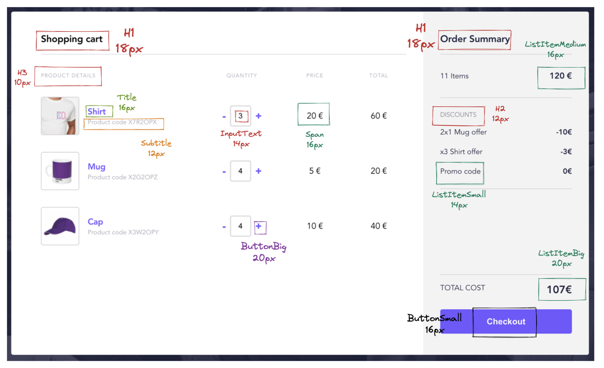
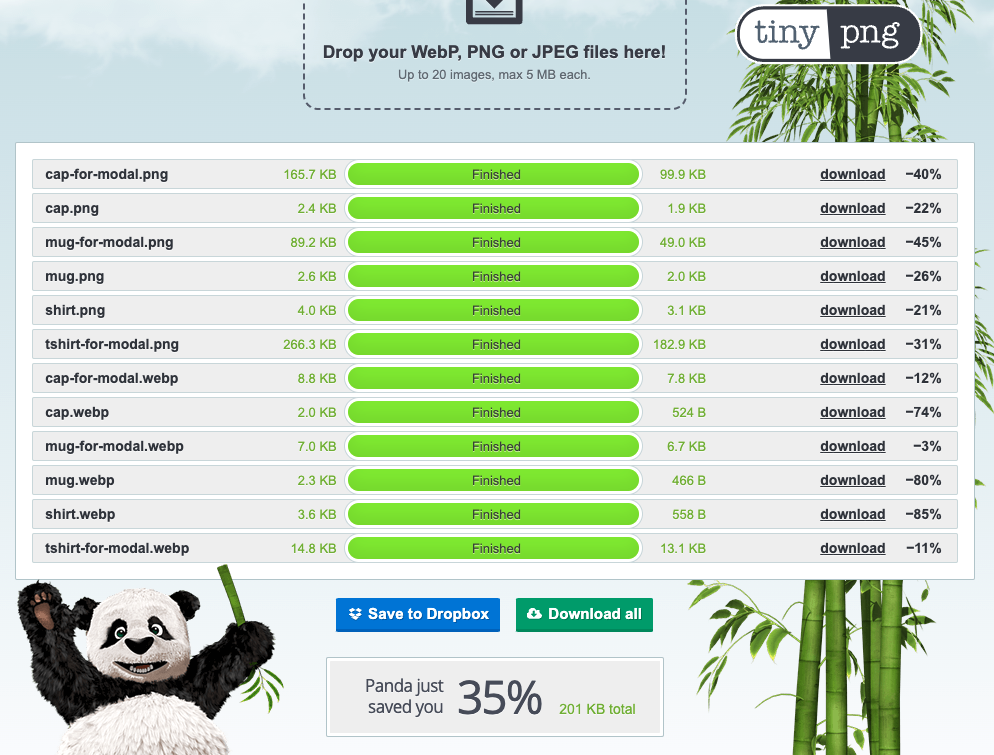

# Shopping Cart

## General information

This repository holds a **shopping cart** app. 👕 🧢 ☕️

It was developed with **React JS**, **Typescript** and **Styled Components**! 🚀

You can see the final result either running `npm start` from the CLI or visiting it on my Netlify account!

**[👉🏼 View shopping cart on Netlify 👈🏼](https://shopping-cart-fvalles.netlify.app/)**

## Coding details

- **Reusable components** were created. They are located in `src/components`. Each of them has its own markdown file which shows different usage examples.
- **Path aliases** were created to be able to import components and interfaces more easily. Example: `import { Div } from '@components/div'; `
- **Typographic reusable components** are located in `src/typography`. Below I attach an image of how I decided which components to create.
  
- **A color palette and common fonts** were created in `src/core/theme` and shared through a `<ThemeProvider />` to the whole app.
- A **global-style.ts** file was created in `src/core/theme` to hold all CSS common styles.
- **WebP image support** was added to improve SEO/SEM and user experience, as WebP images are lighter compared to PNG, JPG, JPEG and GIF formats.
- To handle **vertical spaces**, a reusable `<Spacer />` component was created.
- All PNG (that act as a fallback if the user's browser doesn't support WebP) and WebP images were **compressed** with `tinypng.com` to save space in the app while maintaining image quality. Below I attach the compression results obtained:
  
- `<Snackbar />` component was used to tell the user that a product was added to the cart from the product details modal screen.
- The checkout button informs the user with a `<Snackbar />` that the selected items are ready to be purchased!
- `localStorage` was used throgh the `Checkout` class to save added products across browser sessions.
- **Unit tests** were created under a `__tests__` folder across the entire app for: **components, screen, functions** and **custom hooks**.
